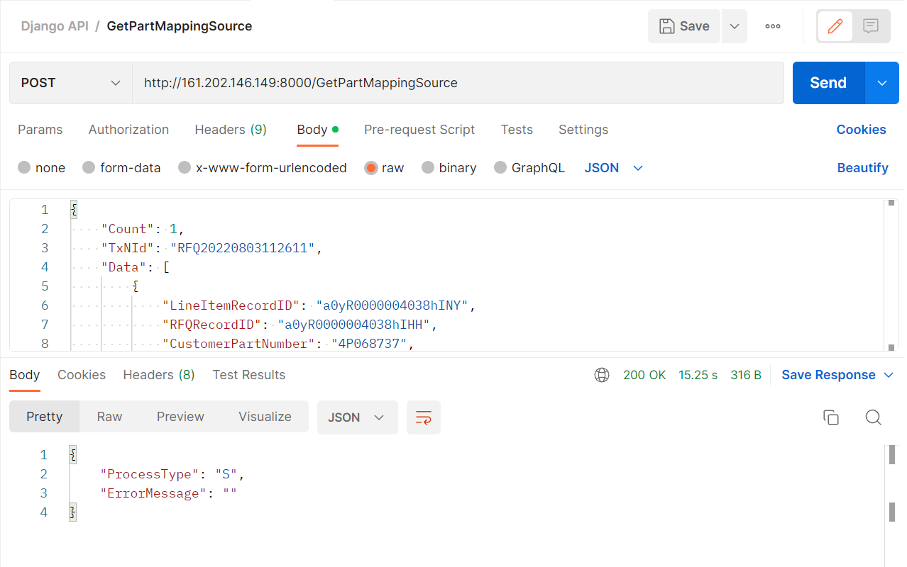
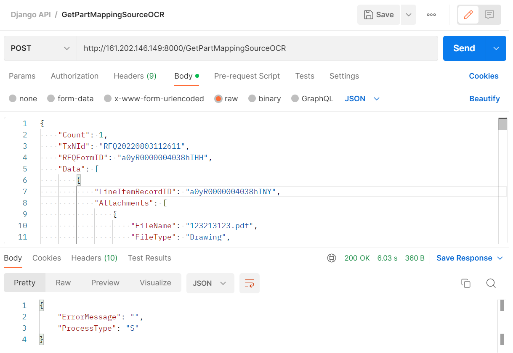

# QuotationPlatform-API
### How to run
#### install lib
```commandline
pip install -r  requirements.txt
```
init DB schema
```commandline
python manage.py makemigrations mapping_source 
python manage.py migrate 
```
Create admin user account
```commandline
python manage.py createsuperuser 
```
Run server
```commandline
python manage.py runserver  
```

admin page: [127.0.0.1:8000/admin](http://127.0.0.1:8000/admin)
### API
#### GetPartMappingSource

#### GetPartMappingSourceOCR

#### PartMappingJson

#### GetWinRate

#### CheckAlive
